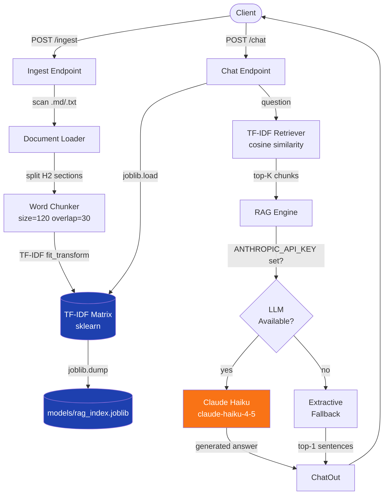

# RAG Docs Chat API

[](https://github.com/sergidose/rag-docs-chat-api/actions/workflows/ci.yml)
[](https://www.python.org/)
[](https://fastapi.tiangolo.com/)
[](https://hub.docker.com/)
[](https://anthropic.com/)
[](LICENSE)
[](https://github.com/astral-sh/ruff)

> A production-ready REST API that turns your Markdown and text documentation into an intelligent Q&A system — powered by TF-IDF retrieval with **optional LLM-powered generation via Claude**.

---

## Overview

Drop your `.md` or `.txt` files into `data/raw/`, call `POST /ingest`, and your documentation becomes queryable in seconds. The `/chat` endpoint retrieves the most relevant chunks and — when an Anthropic API key is configured — synthesises a fluent answer using **Claude Haiku**. Without the key it falls back gracefully to fast extractive mode.

```
POST /ingest   →  builds a TF-IDF index from your docs
POST /chat     →  retrieves top-K chunks + generates (or extracts) an answer
```

---

## Architecture



---

## Features

| Feature | Details |
|---|---|
| **Dual-mode RAG** | LLM generation (Claude) with extractive fallback |
| **Semantic chunking** | H2-section-aware splitting with configurable word overlap |
| **Auto OpenAPI docs** | Swagger UI at `/docs`, ReDoc at `/redoc` |
| **API key auth** | Protect `/ingest` with `X-Api-Key` header |
| **Rate limiting** | 30 req/min on `/chat` via slowapi |
| **CORS** | Configurable allowed origins |
| **Structured logging** | ISO timestamps, level-tagged, LOG_LEVEL env var |
| **Docker + Compose** | Health-checked container, named volume for the index |
| **CI/CD** | GitHub Actions: lint → test (Py 3.10 & 3.12) → Docker build + smoke |
| **Test suite** | Unit + integration tests, `pytest-cov`, 60%+ coverage gate |

---

## Quick Start

### Docker (recommended)

```bash
# 1. Copy environment template
cp .env.example .env

# 2. Add your docs
cp your-docs/*.md data/raw/

# 3. Start
docker compose up --build

# 4. Index your docs
curl -X POST http://localhost:8000/ingest

# 5. Ask a question
curl -X POST http://localhost:8000/chat \
  -H "Content-Type: application/json" \
  -d '{"question": "What is the returns policy?"}'
```

### Local

```bash
python -m venv .venv
source .venv/bin/activate        # Windows: .venv\Scripts\activate
pip install -r requirements.txt -r requirements-dev.txt
pip install -e .

cp .env.example .env             # edit as needed
uvicorn app.main:app --reload
```

> Swagger UI → http://localhost:8000/docs

---

## API Reference

### `GET /health`

Liveness check.

```json
{ "status": "ok" }
```

---

### `GET /index-info`

Returns metadata about the loaded index.

```json
{
  "loaded": true,
  "retriever_type": "tfidf",
  "n_docs": 5,
  "n_chunks": 42,
  "created_at_utc": "2026-06-24T10:00:00+00:00"
}
```

---

### `POST /ingest`

Scans `DATA_DIR` for `.md` / `.txt` files, builds the TF-IDF index and persists it.
Protected by `X-Api-Key` when `API_KEY` is set.

```bash
curl -X POST http://localhost:8000/ingest \
  -H "X-Api-Key: your-secret-key"
```

```json
{
  "retriever_type": "tfidf",
  "n_docs": 5,
  "n_chunks": 42,
  "created_at_utc": "2026-06-24T10:00:00+00:00"
}
```

---

### `POST /chat`

Query the indexed documentation.

**Request**

| Field | Type | Default | Description |
|---|---|---|---|
| `question` | string | — | 2–500 characters |
| `top_k` | integer | 5 | 1–20 chunks to retrieve |

```bash
curl -X POST http://localhost:8000/chat \
  -H "Content-Type: application/json" \
  -d '{"question": "How many days do I have to return an item?", "top_k": 3}'
```

**Response**

```json
{
  "answer": "You can request a return within 30 days of purchase.",
  "mode": "llm",
  "sources": [
    {
      "source": "faq.md",
      "section": "Returns Policy",
      "chunk_id": 2,
      "score": 0.87,
      "snippet": "You can request a return within 30 days of purchase. Contact…"
    }
  ]
}
```

`mode` is `"llm"` when Claude generated the answer, `"extractive"` otherwise.

---

## Configuration

All settings are read from environment variables (or `.env`). See `.env.example` for the full reference.

| Variable | Default | Description |
|---|---|---|
| `DATA_DIR` | `data/raw` | Directory scanned for documents |
| `MODELS_DIR` | `models` | Where the index is saved |
| `CHUNK_SIZE` | `120` | Words per chunk |
| `CHUNK_OVERLAP` | `30` | Word overlap between chunks |
| `TOP_K_DEFAULT` | `5` | Default chunks returned by `/chat` |
| `PORT` | `8000` | API server port |
| `LOG_LEVEL` | `INFO` | `DEBUG` / `INFO` / `WARNING` |
| `CORS_ORIGINS` | `*` | Comma-separated allowed origins |
| `API_KEY` | *(unset)* | When set, protects `POST /ingest` |
| `ANTHROPIC_API_KEY` | *(unset)* | Enables Claude-powered answers |

---

## Development

```bash
# Lint
ruff check .

# Tests
pytest -q

# Tests with coverage report
pytest --cov=src --cov=app --cov-report=term-missing

# Install git hooks
pre-commit install
```

### Project layout

```
rag-docs-chat-api/
├── app/
│   └── main.py          # FastAPI app — endpoints, middleware, lifespan
├── src/
│   ├── auth.py          # X-Api-Key dependency
│   ├── chunking.py      # Word-based chunker with overlap
│   ├── config.py        # Environment variables
│   ├── docs.py          # Document discovery & loading
│   ├── index.py         # Build / save / load TF-IDF index
│   ├── llm.py           # Claude API integration
│   ├── logger.py        # Structured logging setup
│   ├── markdown.py      # H2-section splitter
│   ├── rag.py           # Retrieval + answer synthesis
│   └── retriever.py     # TfidfRetriever (sklearn)
├── tests/
│   ├── conftest.py      # Shared fixtures & sample docs
│   ├── test_api.py      # Integration tests (all endpoints)
│   ├── test_chunking.py # Unit tests — chunker
│   ├── test_rag_unit.py # Unit tests — RAG engine
│   └── test_sanity.py   # Config sanity checks
├── data/raw/            # Your documentation goes here
├── models/              # Generated index (git-ignored)
├── scripts/
│   └── start_api.py     # Entry point: auto-ingest + uvicorn
├── .github/workflows/
│   └── ci.yml           # CI: lint → test → Docker build & smoke
├── Dockerfile
├── docker-compose.yml
└── .env.example
```

---

## Extending the Retriever

The `TfidfRetriever` in [src/retriever.py](src/retriever.py) follows a simple interface (`build(texts)` / `query(text, k)`). Swap it for a dense retriever (FAISS + sentence-transformers, OpenAI embeddings, etc.) without touching the rest of the codebase.

---

## License

MIT © [Sergi Dose](https://github.com/sergidose)
